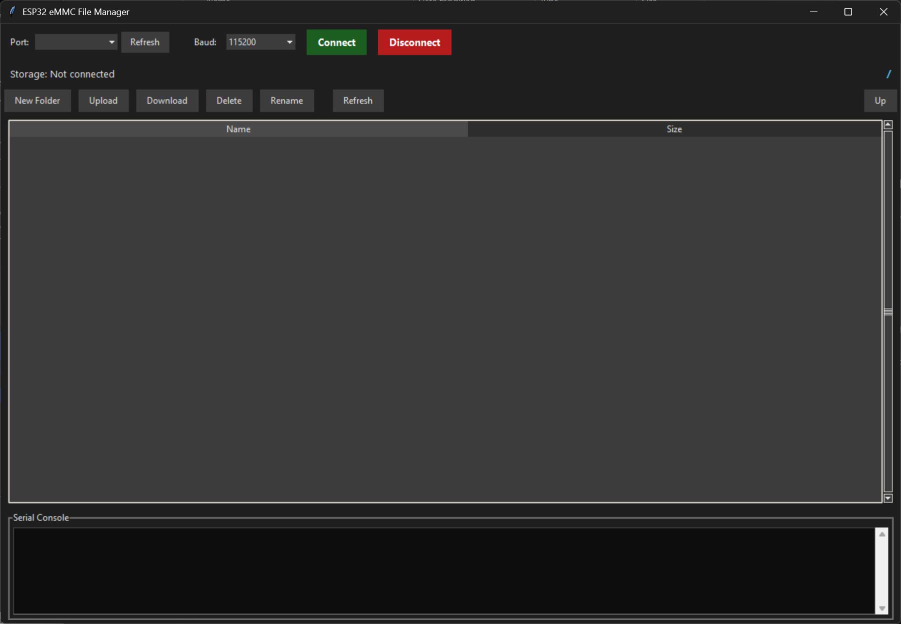

# ESP32 MMC File Manager (Desktop + Firmware)



A **full-featured, high-speed file manager** for the ESP32-S3 with MMC (SD or EMMC) storage.
It lets you:

* Browse directories (double-click to enter)
* Upload / download any file
* Create folders
* Rename / delete files **and** folders (recursive delete)
* See total / free storage in GB (2-decimal precision)
* Work with **any filename** – spaces, Unicode, special characters are fully supported

All communication is over a **single USB-Serial link** (up to **2 000 000 baud**).

---

## Purpose

I found myself with ESP32 based projects that have EMMC storage that needs to be managed (such as pre-loading files) and
wanted a tool that could do this without adding heavy features such as USB MSC or Web Servers to projects that don't 
need them. This tool solved that problem for me and it may be useful to you too.

---

## Desktop Application (Python)

### Requirements
```bash
pip install -r requirements.txt
```
### Run
```bash
python src/ESPFileManager.py
```

### Building the Executable (Windows)
You can create a standalone `.exe` file using PyInstaller:

1. Install requirements:
   ```bash
   pip install -r requirements.txt
   ```
2. Run the build command:
   ```bash
   pyinstaller --noconfirm --onefile --windowed --name "ESPFileManager" "src/ESPFileManager.py"
   ```
   
   *Note: To add an icon, append `--icon="icon.ico" --add-data "icon.ico;."` to the command.*

The executable will be generated in the `dist/` folder.

## ESP32 Firmware

### Hardware

* ESP32-S3 with SD or eMMC (SD_MMC)
* USB-CDC or native USB-Serial

### Library
Only the standard Arduino ESP32 core and SD_MMC are required.

### How to use
```cpp
#include "ESP32FileManager.h"

ESP32FileManager fileManager;   // global instance

void setup() {
  Serial.begin(2000000);  // High baud rate recommended
  delay(100);
  while (!Serial) delay(10);

  if (!SD_MMC.begin("/sdcard", true)) {
    Serial.println("ERROR: Mount Failed");
    while (1) delay(100);
  }
  
  fileManager.begin();  // Optional: sends initial READY
}

void loop() {
  fileManager.handleFileManager();   // <-- ONLY THIS LINE NEEDED
  
  // Optional: suppress debug output during transfers
  if (!fileManager.isTransferActive()) {
    // Your debug Serial.print() calls here
  }
}
```

### Advanced Features
The firmware class provides additional methods for advanced use cases:

- **`isTransferActive()`** - Returns `true` during file uploads. Use this to suppress debug Serial output that would interfere with the binary transfer.
- **`setKeepAliveCallback(callback)`** - Register a function that fires every ~200ms during long transfers. Useful for sending heartbeats or updating displays.

## Protocol
All commands are line-based and end with \n.
Paths are quoted when they contain spaces.

### Basic Commands
```
STORAGE                     → TOTAL:1234567890 FREE:987654321\n
                              DONE
LIST "/path"                → FILE : name.ext SIZE : 12345\n
                              DIR : subdir\n
                              DONE
CREATE_DIR "/new folder"    → DIR created\n
                              DONE
GETSIZE "/file.txt"         → SIZE:54321\n
                              DONE
GETDATA "/file.txt"         → (raw binary, exactly SIZE bytes)
DELETE "/file.txt"          → DELETED\n
                              DONE
REMOVE_DIR "/folder"        → REMOVED\n
                              DONE
RENAME "/old" "/new"        → RENAMED\n
                              DONE
```

### PUTFILE (Chunked Transfer with Flow Control)
The PUTFILE command uses a robust chunked protocol to handle large files reliably:

```
→ PUTFILE "/file.bin" 10485760
← READY 4096
→ (send 4096 bytes)
← NEXT
→ (send 4096 bytes)
← NEXT
... (repeat until all data sent)
← OK
← DONE
```

**Flow:**
1. Client sends `PUTFILE "path" size`
2. ESP32 responds with `READY chunk_size` (typically 4096 bytes)
3. Client sends exactly `chunk_size` bytes
4. ESP32 writes to SD and responds with `NEXT`
5. Repeat steps 3-4 until all data is sent
6. ESP32 responds with `OK` then `DONE`

If any error occurs, ESP32 sends `ERROR` instead of `NEXT`/`OK`.

## Known Limitations
* **File size** – No practical limit. Files are streamed in 4KB chunks for uploads and 32KB chunks for downloads.
* **Recursive delete** - May take a few seconds for very large folders (progress is shown in console).
* **Debug output during transfers** - The Python app filters debug messages, but for best reliability, use `isTransferActive()` to suppress Serial output during file transfers.
